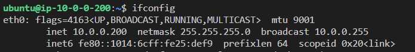
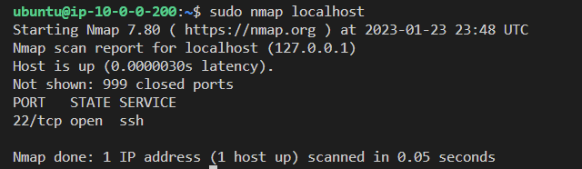
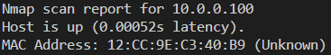
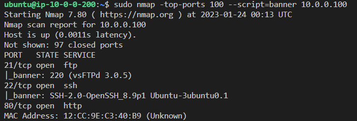

# Scanning Ports with NMAP
## Lab Description: In this Lab, you will learn some basic Nmap techniques

You are new to Dark Kittens Team, and you have been tasked with using nmap to start looking for other devices on the same network you have oreviously infiltrated a device on and trying to find if  other devices have any vulnerable or opent ports to exploit. 

1. You have been given credentials and keys used to login to the remote device that ha sbeen exploited. this is your first step, you need to run the following command `ssh ubuntu@<public ip> -i test-key` from whatever location that also contains the test-key file.  the `-i` flag is there to reference the key file `test-key`

2. Now that you are inside of the exploited device and network, lets figure out what our own IP address and network is using the command `ifconfig`.  You should note the **inet** and **netmask** entries.

3. You should look at your own device even further and see what local ports are open,  you can run `sudo nmap localhost` to look at your exploited hosts open ports.  This is usefull for building a better picture of the overall network topology.

4. Next you are going to run a local ping only scan, you are trying to stay as stealthy as possible as to avoid suspicion, scanning locally is less likely to raise any alarms as there wont be any perimeter network secrutiy devices involved. You can use `sudo nmap -sn -PE 10.0.0.0/24`.  The `-sn` flag tells nmap to NOT do a port scan after discovery, the `-PE` flag tells nmap to send an ICMP echo request to the targets.  The `10.0.0.0/24` was determined from the earlier ifconfig lookup and turning the netmask into a CIDR, the same command could be accomplished with a range command like this `10.0.0.0-255` as well.

After you run the Ping scan, look for the host that shows up.  That will be your target.

5. We have a device identified, its time to find out if there are any open parts that are exploitable.  We can run a more intense scan against some popular ports on this individual device.  We will run `sudo nmap -top-ports 100 --script=banner 10.0.0.100`.  The `-top-ports` 100 will scan the top 100 popular ports, the `--script=banner` flag will look for the specific server information associated with any ports that are open.

6. Lets analyze what we have scanned and discovered.  The ports 21, 22, and 80 are open.  The banner for port 22 (SSH) shows Ubuntu which lets us know the OS.  Port 21 is FTP and it could be exploited with username and password brute force attacks.  Port 80 is HTTP and is a non-secure web browsing port.  You ahve absoulteyl found some exploitable information.  Not a bad first day!

