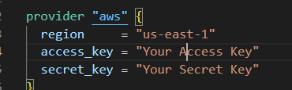
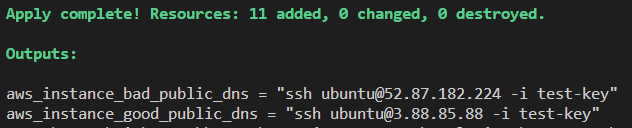

## Starting Point
This lab uses a custom made terraform repo that runs AWS.  There is nothing needed outside of this terraform repository besides the cloud users programmtic Access and Secret Key.  Basic scripts are all included in the instance user data portion.  Every resource created here is tagged with the name "Pluralsight Lab" in case something fails in deployment and resources need to be identified. Access keys go here in the provider.tf file.

## Lab Notes
This Lab will create a small environment in the us-east-1 region, this can be changed in the variables file and it will still run since the ubuntu images are not pulled from the regional AMI-number.  There will be a VPC, Subnet, IGW, Route table, Route table association, and a security group with lab based access (open).  The Ouput will show a copy and paste command that you can use to SSH into either good or bad instance via the public ip, and the key that is added to the current working directory you ran the terraform from. 

## Learner Notes
In order for this to work, Terraform is required to be installed on your local computer and you need an AWS account and programmtic user.  That users credentials are what need to be input into the providers file under "your Access key and Your Secret Key",  that programmtic user, for the sake of this lab, can have admin access.  The keys should never leave your local computer. The terraform will have 2 outputs, the learner will need the string `ssh ubuntu@<Public I.P.> -i test-key` as well as the test-key file in whatever directory they are trying to ssh from.

